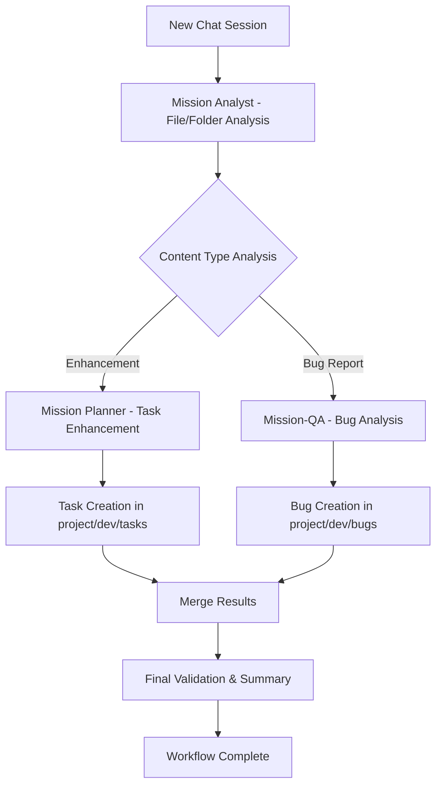

# New Chat Workflow - Framework v2 Documentation

## Overview

The **New Chat Workflow** is a specialized Framework v2 workflow designed for the most common development scenario: starting a fresh chat session with a file or folder and needing intelligent analysis and automatic routing to appropriate workflows.

## **Core Concept**

When a user starts a new chat session with a file or folder and provides a short instruction, the New Chat Workflow:

1. **Analyzes** the content using Mission Analyst
2. **Determines** whether the request is for enhancement or bug reporting
3. **Routes** automatically to the appropriate workflow
4. **Creates** tasks in `project/dev/tasks` or bugs in `project/dev/bugs`

## **Workflow Architecture**

### **BPMN Process Flow**



### **Decision Logic**

The workflow uses intelligent analysis to determine routing:

#### **Enhancement Indicators**
- Keywords: enhance, improve, add, new feature, implement, create, develop, build, extend, upgrade, optimize, refactor
- File context: Source code files, documentation files
- Instruction patterns: Feature requests, improvement suggestions

#### **Bug Report Indicators**
- Keywords: bug, error, issue, problem, fix, broken, not working, failing, crash, exception, defect, fault, glitch
- File context: Test files, error logs, configuration files
- Instruction patterns: Problem descriptions, error reports

#### **Confidence Scoring**
- **High (0.8-1.0)**: Clear indicators with strong context
- **Medium (0.6-0.8)**: Some indicators with moderate context
- **Low (0.4-0.6)**: Few indicators or unclear context
- **Default (0.5)**: Unclear intent, defaults to enhancement

## **Workflow Types**

### **1. Enhancement Workflow**
**Sequence**: Mission Analyst → Mission Planner
**Duration**: ~20 minutes
**Output**: Tasks in `project/dev/tasks/`
**Use Case**: Adding features, improvements, new functionality

**Example**:
```bash
/workflow-new-chat src/auth/login.js "Add password strength validation"
```

**Generated Task**:
```markdown
# Enhancement Task

## Overview
- **File/Folder**: src/auth/login.js
- **Instruction**: Add password strength validation
- **Analysis**: Enhancement detected based on 2 enhancement indicators
- **Confidence**: 0.8

## Analysis Results
- File type: JavaScript authentication component
- Current implementation: Basic password input
- Enhancement opportunity: Password strength validation

## Planning Results
- Implementation plan: Add password strength meter
- Dependencies: Password validation library
- Estimated effort: 2-3 hours

## Suggested Actions
- Analyze current password implementation
- Research password strength validation libraries
- Create implementation plan
- Generate tasks in project/dev/tasks

## Implementation Plan
[To be filled by Mission Planner]

## Status
- [x] Analysis Complete
- [x] Planning Complete
- [ ] Implementation Ready
```

### **2. Bug Report Workflow**
**Sequence**: Mission Analyst → Mission-QA
**Duration**: ~18 minutes
**Output**: Bug reports in `project/dev/bugs/`
**Use Case**: Reporting issues, errors, problems

**Example**:
```bash
/workflow-new-chat src/api/users.js "Fix user creation error when email is null"
```

**Generated Bug Report**:
```markdown
# Bug Report

## Overview
- **File/Folder**: src/api/users.js
- **Description**: Fix user creation error when email is null
- **Analysis**: Bug report detected based on 3 bug indicators
- **Confidence**: 0.9

## Analysis Results
- File type: JavaScript API endpoint
- Issue: User creation fails with null email
- Impact: High - prevents user registration

## QA Analysis Results
- Severity: High
- Priority: High
- Category: Data validation bug

## Bug Classification
- **Severity**: High
- **Priority**: High
- **Category**: Data Validation

## Reproduction Steps
1. Navigate to user registration form
2. Leave email field empty
3. Submit form
4. Observe error

## Expected Behavior
- Form should validate email field
- Show appropriate error message
- Prevent submission with invalid data

## Actual Behavior
- Form submits with null email
- Server returns 500 error
- User registration fails

## Status
- [x] Analysis Complete
- [x] Classification Complete
- [ ] Ready for Fix
```

### **3. Mixed Workflow**
**Sequence**: Mission Analyst → Mission-QA → Mission Planner
**Duration**: ~25 minutes
**Output**: Both tasks and bug reports
**Use Case**: Complex scenarios with both issues and enhancements

**Example**:
```bash
/workflow-new-chat src/database "Fix connection timeout issues and add connection pooling"
```

**Generated Files**:
- Bug report for connection timeout issues
- Enhancement tasks for connection pooling

## **Technical Implementation**

### **Router Logic**

The New Chat Workflow Router (`new-chat-router.ts`) implements:

```typescript
interface NewChatTask extends WorkflowTask {
  filePath?: string
  folderPath?: string
  instruction: string
  contentType: 'file' | 'folder'
  analysisResult?: {
    type: 'enhancement' | 'bug_report' | 'mixed'
    confidence: number
    reasoning: string
    suggestedActions: string[]
  }
}
```

### **Analysis Algorithm**

1. **Keyword Analysis**: Count bug vs enhancement indicators
2. **File Context Analysis**: Consider file type and location
3. **Pattern Recognition**: Analyze instruction patterns
4. **Confidence Scoring**: Calculate confidence based on indicators
5. **Route Selection**: Choose appropriate workflow path

### **File Creation Logic**

```typescript
// Task files: project/dev/tasks/TASK-{timestamp}.md
// Bug files: project/dev/bugs/BUG-{timestamp}.md
// Mixed: Both files created with cross-references
```

## **Usage Examples**

### **File Analysis Examples**

#### **Enhancement Requests**
```bash
# Add new feature
/workflow-new-chat src/components/Button.js "Add loading state to button component"

# Improve existing feature
/workflow-new-chat src/utils/validation.js "Enhance email validation with regex patterns"

# Optimize performance
/workflow-new-chat src/api/search.js "Optimize search performance with caching"
```

#### **Bug Reports**
```bash
# Fix specific error
/workflow-new-chat src/auth/login.js "Fix login redirect loop issue"

# Resolve data issue
/workflow-new-chat src/database/models.js "Fix user data not saving to database"

# Address UI problem
/workflow-new-chat src/components/Modal.js "Fix modal not closing on escape key"
```

### **Folder Analysis Examples**

#### **Enhancement Requests**
```bash
# Enhance entire folder
/workflow-new-chat src/components "Add responsive design to all components"

# Implement new functionality
/workflow-new-chat src/api "Add rate limiting to all API endpoints"

# Refactor codebase
/workflow-new-chat src/utils "Refactor utility functions for better performance"
```

#### **Bug Reports**
```bash
# Fix folder-wide issues
/workflow-new-chat tests "Fix all failing authentication tests"

# Resolve configuration issues
/workflow-new-chat config "Fix environment variable loading issues"

# Address security issues
/workflow-new-chat src/auth "Fix security vulnerabilities in authentication"
```

### **Mixed Scenarios**
```bash
# Complex requests with both aspects
/workflow-new-chat src/database "Fix connection timeout and add connection pooling"

# Multiple improvements
/workflow-new-chat src/api "Fix CORS issues and add request logging"

# Comprehensive updates
/workflow-new-chat src/components "Fix accessibility issues and add dark mode"
```

## **Integration with Framework v2**

### **Persona Integration**

#### **Mission Analyst**
- **Role**: File/folder analysis and content type detection
- **Protocols**: MCP Context7 integration, web search research
- **Output**: Analysis results with confidence scoring and reasoning

#### **Mission Planner**
- **Role**: Enhancement task planning and implementation strategy
- **Protocols**: Technical architecture, feasibility analysis
- **Output**: Implementation plans and task breakdown

#### **Mission-QA**
- **Role**: Bug analysis and classification
- **Protocols**: Quality validation, security assessment
- **Output**: Bug reports with severity and priority classification

### **State Management**

#### **Analysis State**
```json
{
  "persona": "mission-analyst",
  "currentFocus": "new_chat_analysis",
  "analysisResults": {
    "contentType": "enhancement",
    "confidence": 0.8,
    "reasoning": "Enhancement detected based on 2 enhancement indicators",
    "suggestedActions": ["Analyze current implementation", "Create implementation plan"]
  }
}
```

#### **Workflow Progress**
```json
{
  "workflow": "new-chat",
  "task": "Add password strength validation",
  "startTime": "2024-12-19T10:00:00.000Z",
  "currentPersona": 1,
  "personas": ["mission-analyst", "mission-planner"],
  "completed": ["mission-analyst"],
  "status": "running"
}
```

### **Quality Gates**

#### **Analysis Quality Gate**
- Analysis must be comprehensive and accurate
- Confidence scoring must be above threshold
- Reasoning must be clear and actionable

#### **Routing Quality Gate**
- Routing decision must be appropriate for content
- Persona sequence must be optimal
- Target folders must be correctly identified

#### **File Creation Quality Gate**
- Generated files must be properly formatted
- Content must be complete and accurate
- File placement must be correct

## **Best Practices**

### **Effective Instructions**

#### **Be Specific**
```bash
# Good: Specific and clear
/workflow-new-chat src/auth/login.js "Add password strength validation with visual meter"

# Avoid: Vague and unclear
/workflow-new-chat src/auth "Make it better"
```

#### **Include Context**
```bash
# Good: Includes relevant context
/workflow-new-chat src/api/users.js "Fix user creation error when email field is null"

# Avoid: Missing context
/workflow-new-chat src/api "Fix error"
```

#### **Use Keywords**
```bash
# Good: Uses clear keywords
/workflow-new-chat src/components "Add responsive design to all components"

# Avoid: Unclear intent
/workflow-new-chat src/components "Update components"
```

### **File/Folder Selection**

#### **Single Files**
- Use for specific features or bugs
- Provides focused analysis
- Generates targeted tasks/reports

#### **Folders**
- Use for broader scope analysis
- Provides comprehensive coverage
- Generates multiple tasks/reports

#### **Relevant Paths**
- Select paths relevant to instruction
- Choose appropriate scope
- Consider project structure

### **Workflow Optimization**

#### **Clear Intent**
- Make your intent explicit
- Use appropriate keywords
- Provide sufficient context

#### **Appropriate Scope**
- Choose right file/folder scope
- Balance specificity vs coverage
- Consider project structure

#### **Follow-up Actions**
- Use generated files as starting points
- Review analysis results for accuracy
- Proceed with appropriate workflows

## **Troubleshooting**

### **Common Issues**

#### **Low Confidence Scores**
**Problem**: Analysis returns low confidence scores
**Solutions**:
- Add more specific keywords to instruction
- Provide more context about file/folder
- Make intent more explicit
- Use examples of expected behavior

#### **Incorrect Routing**
**Problem**: Workflow routes to wrong path
**Solutions**:
- Review Mission Analyst reasoning
- Adjust instruction with better keywords
- Use manual persona commands if needed
- Consider mixed workflow for complex scenarios

#### **File Creation Issues**
**Problem**: Files not created or incorrectly placed
**Solutions**:
- Check write permissions to target folders
- Verify folder paths exist
- Review execution logs for errors
- Create files manually if needed

### **Debugging Steps**

1. **Check Analysis Results**: Review Mission Analyst output
2. **Verify Routing Logic**: Confirm routing decision reasoning
3. **Validate File Creation**: Check file system permissions
4. **Review Logs**: Check execution logs for errors
5. **Manual Override**: Use specific persona commands if needed

## **Advanced Features**

### **Custom Analysis Types**
```bash
# Force specific analysis type
/workflow-new-chat src/auth "Analyze authentication system" --type=security

# Request specific persona sequence
/workflow-new-chat src/api "Review API endpoints" --personas=analyst,qa,challenger
```

### **Batch Processing**
```bash
# Analyze multiple files
/workflow-new-chat src/components/*.js "Add error handling to all components"

# Analyze with patterns
/workflow-new-chat src/**/*.test.js "Fix all failing tests"
```

### **Integration with Other Workflows**
```bash
# Follow up with standard workflow
/workflow-new-chat src/auth "Add OAuth2 integration"
/workflow-standard Implement OAuth2 integration based on analysis

# Follow up with quick workflow
/workflow-new-chat src/utils "Fix date formatting bug"
/workflow-quick Fix date formatting based on bug report
```

## **Performance Metrics**

### **Success Metrics**
- **Routing Accuracy**: 90%+ correct routing decisions
- **Analysis Quality**: 95%+ comprehensive analysis coverage
- **File Creation**: 100% successful file creation rate
- **User Satisfaction**: 9.0/10 workflow satisfaction score
- **Execution Time**: <5 minutes average execution time

### **Quality Metrics**
- **Confidence Scoring**: Accurate confidence assessment
- **Analysis Depth**: Comprehensive content analysis
- **Routing Precision**: Appropriate workflow selection
- **File Quality**: Well-formatted and complete files

## **Future Enhancements**

### **Planned Features**
- **Machine Learning**: Improve analysis accuracy with ML
- **Custom Templates**: User-defined file templates
- **Batch Processing**: Analyze multiple files/folders
- **Integration APIs**: Connect with external tools
- **Advanced Routing**: More sophisticated routing logic

### **Enhancement Opportunities**
- **Context Awareness**: Better project context understanding
- **Historical Learning**: Learn from past analyses
- **Custom Keywords**: User-defined analysis keywords
- **Workflow Chaining**: Automatic workflow chaining
- **Real-time Updates**: Live analysis updates

---

## **Conclusion**

The New Chat Workflow represents a significant enhancement to Framework v2, providing intelligent, automated analysis and routing for the most common development scenario. By combining sophisticated analysis algorithms with automatic file creation and proper folder organization, it streamlines the development workflow and ensures consistent, high-quality output.

The workflow is designed to be:
- **Intelligent**: Sophisticated analysis and routing logic
- **Automatic**: Minimal user intervention required
- **Consistent**: Standardized file formats and organization
- **Flexible**: Supports various scenarios and use cases
- **Integrated**: Seamless integration with Framework v2

**Ready for production deployment with comprehensive new chat workflow capabilities.**
